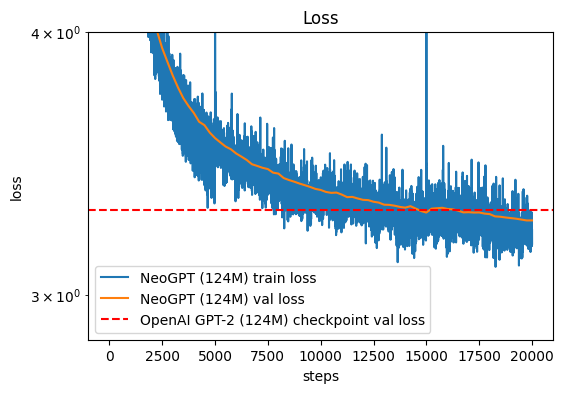
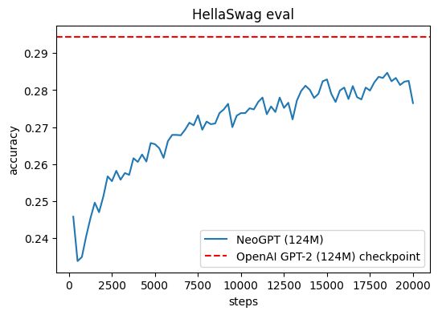

# NeoGPT

NeoGPT is a project aimed at recreating OpenAI's GPT-2 from scratch. The project follows the general architecture and design principles of GPT-2, while also experimenting with certain custom modifications in the training phase. The primary objective is to explore the inner workings of transformer models, particularly how they scale with data and computational resources. At its core, NeoGPT leverages the transformer architecture, which uses self-attention mechanisms to process sequences of data efficiently. This architecture has become the foundation for many state-of-the-art models in natural language processing (NLP). By recreating GPT-2, the project serves not only as a technical exercise but also as an exploration into the challenges and trade-offs inherent in training large-scale models from scratch.

The training process was initially carried out using Lambda Labs' GPU cluster, which provided access to NVIDIA GPUs. This infrastructure was essential for training the model on a large dataset. However, due to the costs of using these resources over extended periods, the training process was halted before it could be fully completed. The model was only trained for 1 epoch, meaning some improvement could be made by training the model for longer. The inspiration for NeoGPT stems from a tutorial by Andrej Karpathy, who outlines the process of building a GPT-like model from scratch.

Below are images of the training metrics, providing a glimpse into the model's progress during the training process. The first image shows the loss function over time, a standard measure of how well the model is learning. The spikes in the training loss at 5000 and 15000 steps are visible due to having to start the training process from a snapshot of the model. They could have been avoided if the state of the optimizer and the dataset were saved, however, only the state of the model, ie. the parameters were saved. The second image tracks performance on the Hellaswag metric, a task designed to evaluate commonsense reasoning abilities. These metrics give an indication of how the model was performing before the training process was interrupted.

  
*Figure 1: Loss function as a function of training steps.*

  
*Figure 2: Hellaswag metric as a function of training steps.*

In Figure 1, we see that the model is able to surpass the performance of the original GPT2 when it comes to the loss. In Figure 2, we see that the model is not able to perform as well as GPT2 124M in a reasoning task. Hence futher improvements can be made by training the model longer.

Despite the early termination of the training due to computational constraints, this project has provided valuable learnings about the challenges and considerations of building and training large-scale language models. Moving forward, the plan is to refine and fine-tune the model by applying techniques such as Parameter-Efficient Fine-Tuning (PEFT) to enhance its conversational capabilities. With more affordable computational resources, the pretraining can be resumed and expanded, offering the potential for further improvements and more advanced applications.
